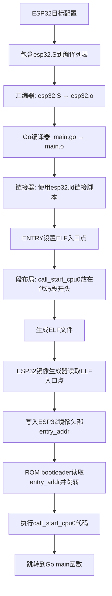

# call_start_cpu0 入口点机制详解

## 概述

`call_start_cpu0` 是ESP32启动的关键入口点，它不是写死的常量，而是通过一套完整的编译链路动态确定的。本文档详细分析其来源、编译过程和工作机制。

## call_start_cpu0 的完整来源链路

### 1. 汇编源码定义

**文件**: `src/device/esp/esp32.S:9-14`
```asm
// Only calling it call_start_cpu0 for consistency with ESP-IDF.
.section .text.call_start_cpu0
1:
    .long _stack_top
.global call_start_cpu0
call_start_cpu0:
    // Xtensa架构初始化代码
    // 禁用/启用寄存器窗口溢出
    // 设置栈指针
    // 启用FPU协处理器
    // 最后跳转到Go main函数
    call4 main
```

**设计特点**:
- **命名一致性**: 注释明确说明"为了与ESP-IDF保持一致"
- **专用代码段**: 放在`.text.call_start_cpu0`段中，确保链接时的位置控制
- **全局符号**: `.global`声明使其可被链接器引用和定位
- **栈指针初始化**: 包含`_stack_top`字面量，用于设置初始栈

### 2. 目标配置中的文件引入

**文件**: `targets/esp32.json:13-16`
```json
{
  "extra-files": [
    "src/device/esp/esp32.S",           // ← call_start_cpu0定义在这里
    "src/internal/task/task_stack_esp32.S"
  ]
}
```

**编译时包含**: 
- ESP32目标构建时自动包含这个汇编文件到编译列表
- 与Go代码一起编译链接，形成完整的可执行映像

### 3. 链接脚本中的入口点声明

**文件**: `targets/esp32.ld:22-34`
```ld
/* The entry point. It is set in the image flashed to the chip, so must be
 * defined.
 */
ENTRY(call_start_cpu0)

SECTIONS
{
    /* Constant literals and code. Loaded into IRAM for now. */
    .text : ALIGN(4)
    {
        *(.literal.call_start_cpu0)  // call_start_cpu0的字面量数据
        *(.text.call_start_cpu0)     // call_start_cpu0的代码段
        *(.literal .text)            // 其他代码的字面量和代码
        *(.literal.* .text.*)
    } >IRAM
}
```

**链接器控制**:
- **ENTRY()指令**: 明确告诉链接器ELF文件的入口点是`call_start_cpu0`符号
- **段排序优先级**: 确保`call_start_cpu0`相关段放在`.text`段的最前面
- **内存区域**: 加载到IRAM(指令RAM)中，保证快速执行

### 4. ESP32固件镜像生成

**文件**: `builder/esp.go:125-134`
```go
// Image header for ESP32/ESP32C3
binary.Write(outf, binary.LittleEndian, struct {
    magic          uint8
    segment_count  uint8
    spi_mode       uint8
    spi_speed_size uint8
    entry_addr     uint32  // ← 关键：从ELF读取的入口地址
    wp_pin         uint8
    spi_pin_drv    [3]uint8
    chip_id        uint16
    min_chip_rev   uint8
    reserved       [8]uint8
    hash_appended  bool
}{
    magic:          0xE9,
    segment_count:  byte(len(segments)),
    entry_addr:     uint32(inf.Entry),  // inf.Entry就是call_start_cpu0的地址
    chip_id:        chip_id,
    // ... 其他字段
})
```

**动态地址解析**:
- `inf.Entry` 来自ELF文件头部，包含链接器解析的`call_start_cpu0`实际地址
- ESP32镜像头部的`entry_addr`字段记录这个地址
- ROM bootloader根据此字段知道跳转目标

## 编译链路流程图



## 为什么叫 call_start_cpu0？

### 1. ESP-IDF兼容性考虑

**ESP-IDF中的同名函数**:
```c
// ESP-IDF bootloader_start.c
void call_start_cpu0(void) {
    // ESP-IDF二级bootloader的入口函数
    bootloader_init();
    bootloader_utility_load_boot_image();
    bootloader_utility_jump_to_app();
}
```

**TinyGo的设计理念**: 
- 借用ESP-IDF约定俗成的函数名
- 让熟悉ESP-IDF的开发者容易理解和迁移
- 保持ESP32开发生态的一致性

### 2. 多核架构的命名约定

ESP32双核架构:
- **CPU0 (PRO_CPU)**: 协议处理器，主核心，负责系统启动
- **CPU1 (APP_CPU)**: 应用处理器，协核心，运行用户应用

**`call_start_cpu0` 含义**:
- 明确表示从CPU0(主核)开始启动
- 为未来可能的多核支持留下命名空间
- 遵循ESP32官方的核心命名规范

### 3. ROM Bootloader的透明性

**重要观察**: ROM bootloader实际上并不关心入口函数的名字，它只关心：
- ESP32镜像头部的`entry_addr`字段值
- 该地址指向有效的可执行代码
- 镜像格式和校验和正确

## 入口点地址的动态解析

### 链接时地址分配

```ld
// targets/esp32.ld 中的内存布局
MEMORY
{
    IRAM (x) : ORIGIN = 0x40080000, LENGTH = 128K
}

SECTIONS
{
    .text : ALIGN(4)
    {
        *(.literal.call_start_cpu0)  // 字面量先放置
        *(.text.call_start_cpu0)     // 代码紧跟其后
        // ... 其他代码
    } >IRAM
}
```

**地址计算**:
1. `call_start_cpu0` 被分配到IRAM起始地址附近 (0x40080000+)
2. 具体偏移取决于字面量数据的大小
3. 链接器计算最终地址并写入ELF文件头部

### 实际验证方法

```bash
# 1. 编译ESP32程序
tinygo build -target=esp32 -o main.elf main.go

# 2. 查看ELF入口点地址
readelf -h main.elf | grep "Entry point"
# 输出示例: Entry point address: 0x40080004

# 3. 验证call_start_cpu0符号地址
objdump -t main.elf | grep call_start_cpu0  
# 输出示例: 40080004 g .text call_start_cpu0

# 4. 检查ESP32镜像头部的入口地址 (偏移8-11字节)
hexdump -C main.bin | head -2
# 第8-11字节应显示相同地址 (小端序): 04 00 08 40

# 5. 验证代码段布局
objdump -h main.elf | grep "\.text"
# 确认.text段的起始地址和call_start_cpu0的位置关系
```

## 与其他架构的对比

### ARM Cortex-M系列
```ld
// ARM使用向量表，入口点是Reset_Handler
ENTRY(Reset_Handler)

.isr_vector : {
    KEEP(*(.isr_vector))    // 向量表放在最前面
} >FLASH
```

### RISC-V架构
```ld
// RISC-V通常使用_start作为入口点
ENTRY(_start)

.text : {
    *(.text._start)         // _start函数优先放置
    *(.text*)
} >FLASH
```

### ESP32 Xtensa的特殊性
```ld
// Xtensa需要特殊的寄存器窗口初始化
ENTRY(call_start_cpu0)

.text : {
    *(.literal.call_start_cpu0)  // Xtensa需要字面量池
    *(.text.call_start_cpu0)     // 启动代码
    // ... 注意字面量必须在代码前面，l32r指令要求
}
```

## 启动代码的Xtensa特殊处理

### 寄存器窗口管理

```asm
call_start_cpu0:
    // 1. 禁用窗口溢出 (Window Overflow Enable)
    rsr.ps a2                    // 读取处理器状态
    movi a3, ~(PS_WOE_MASK)     // WOE掩码取反
    and a2, a2, a3              // 清除WOE位
    wsr.ps a2                    // 写回处理器状态
    rsync                        // 同步
    
    // 2. 设置窗口寄存器
    rsr.windowbase a2            // 读取当前窗口基址
    ssl a2                       // 设置移位数量
    movi a2, 1                   // 移位基数
    sll a2, a2                   // 左移: 1 << windowbase
    wsr.windowstart a2           // 设置窗口启动寄存器
    rsync
    
    // 3. 加载栈指针
    l32r sp, 1b                  // 从字面量池加载_stack_top
    
    // 4. 重新启用窗口溢出
    rsr.ps a2
    movi a3, PS_WOE
    or a2, a2, a3               // 设置WOE位
    wsr.ps a2
    rsync
    
    // 5. 启用FPU协处理器
    movi a2, 1
    wsr.cpenable a2             // 启用协处理器0 (FPU)
    rsync
    
    // 6. 跳转到Go运行时
    call4 main                   // 4字节对齐的调用指令
```

### 为什么需要这些初始化？

1. **寄存器窗口**: Xtensa的特色功能，需要正确初始化才能使用函数调用
2. **栈指针设置**: 确保Go运行时有足够的栈空间
3. **FPU启用**: Go的浮点运算需要硬件FPU支持
4. **内存同步**: rsync确保特殊寄存器写入生效

## 总结

**`call_start_cpu0` 的关键特性**:

1. ✅ **非硬编码**: 通过汇编源码→链接脚本→ELF解析→镜像生成的完整链路
2. ✅ **位置可控**: 链接脚本确保其位于代码段最前面
3. ✅ **地址动态**: 链接器根据内存布局计算实际地址
4. ✅ **架构特化**: 包含Xtensa特有的初始化序列
5. ✅ **生态兼容**: 遵循ESP-IDF的命名约定

这个设计展示了TinyGo编译系统的工程化水准：
- **模块化**: 启动代码、链接控制、镜像生成分离
- **可配置**: 不同目标可以有不同的启动代码
- **标准化**: 遵循既有的生态约定
- **优化**: 针对目标架构的特定优化

`call_start_cpu0` 不仅仅是一个函数名，它代表了一套完整的裸机启动解决方案。